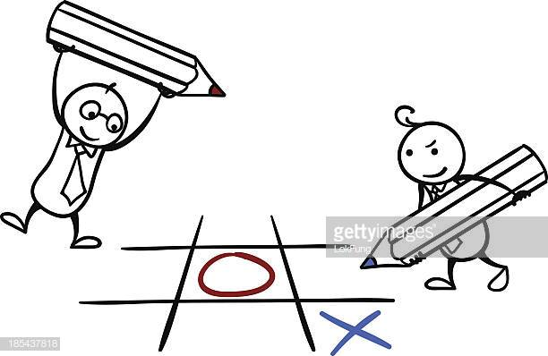

# Tic Tac Toe OOP (Object Oriented Programming)

-   Original project specification at [The Odin Project](https://www.theodinproject.com/courses/ruby-programming/lessons/oop)

### Game description
Tic-tac-toe (American English), noughts and crosses (British English), or Xs and Os is a paper-and-pencil game for two players, X and O, who take turns marking the spaces in a 3×3 grid. The player who succeeds in placing three of their marks in a horizontal, vertical, or diagonal row wins the game. [From Wikipedia](https://en.wikipedia.org/wiki/Tic-tac-toe) for more details about Tic-Tac-Toe.

## Built with:

-   Ruby

## How to run the game:

-   Clone or download(zip) this project [from github](https://github.com/dannkkie/tic-tac-toe) using git clone https://github.com/dannkkie/tic-tac-toe
- 	Open a terminal window and go to game folder (cd ../tic-tac-toe/)   
-   Run the game, using command: bin/main

### Playing Instructions

You will be presented with the following screen. Since this is a console based game, every move will be simulated by keyiing in data.

+ Enter your player name, and let the other player enter their player name too
+ The game automatically assigns the first player the X token and the second player the O token
+ Follow the instructions on the user interface i.e enter the number of the grid where you would like to place your token i.e key a a number between 1 and 9.
+ Do not place your token on a grid that is already chosen by the other player
+ The first player to succeed in placing three of their marks in a horizontal, vertical, or diagonal row wins the game.

#### Authors

* [@mosesmuchemi](https://github.com/mosesmuchemi)
* [@dannkkie](https://github.com/dannkkie)

## 🤝 Contributing

Contributions, issues and feature requests are welcome!

Feel free to check the [issues page](issues/).

## Show your support

Give a ⭐️ if you like this project!